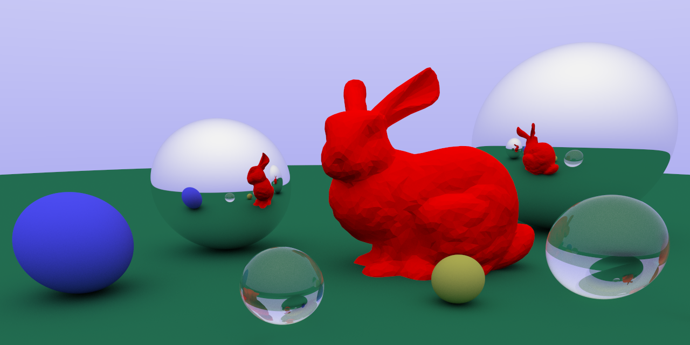

# Rust Based Ray Tracer




## Core Features
* speed - both SSE and AVX support
* meshes can be loaded via .obj file
* scenes are configured easily via yaml (see scenes/example_scene.yml)

## Try it out!
```bash
git clone https://github.com/baurst/rbrt.git
cd rbrt

# important: build with avx and sse enabled
RUSTFLAGS='-C target-feature=+sse,+avx' cargo build --release

# download the stanford bunny
wget http://graphics.stanford.edu/~mdfisher/Data/Meshes/bunny.obj

# run the raytracer: adjust samples according to your needs
./target/release/rbrt --target_file out.png --height 768 --width 1024 --samples 50 --config scenes/example_scene.yaml
```
Do not forget to set RUSTFLAGS='-C target-feature=+sse,+avx', otherwise a scalar fallback will be used and the raytracer will run very slow.

On my machine the **AVX** enabled version runs over **5(!) times faster** than the scalar fallback.
For SSE, the speedup over the scalar version is at a factor of around 3.3. 

## Coordinate System
The raytracer uses a right-handed coordinate system, with negative z pointing through the camera lens towards the scene.

## Configuring the scene
For an example scene configuration check out scenes/example_scene.yaml.
Triangle meshes can be loaded by providing a path to an .obj file, spheres can also be added to the config yaml.
For each scene element, a material definition needs to be specified in the config yaml.
Currently, three materials are supported: 
* matte, lambertian material with paramter albedo, e.g. (0.02,0.2,0.02)
* transparent dielectric material with parameter ref_idx, e.g. 1.8
* metallic material, with scalar parameter roughness and albedo

All of these features can be seen in the example_scene.yaml file in the config folder.

## About this project
This is yet another raytracer written in Rust. Coming from C++, Rusts ownership concepts (and easy way of managing dependencies and cross-platform builds) fascinated me and so I thought it could be fun to write a lightweight but capable raytracer to get to know the language better.
The inspiration for this project came from the excellent book ['Raytracing In One Weekend'](https://raytracing.github.io) by Peter Shirley as well as ssloys awesome [tinyraytracer](https://github.com/ssloy/tinyraytracer).
